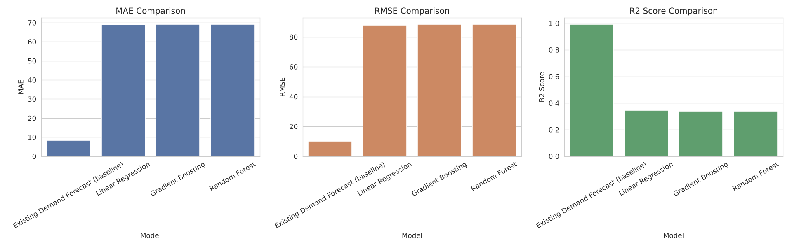
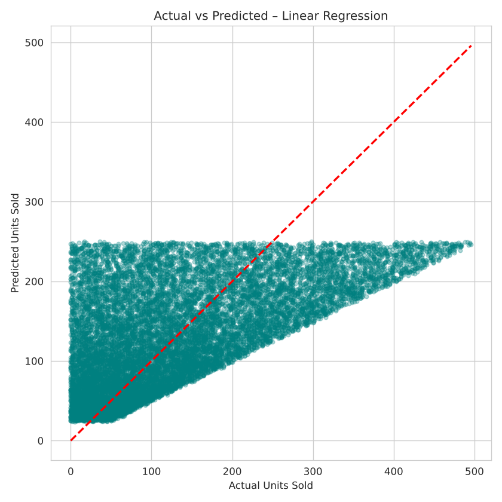

# 🛒 Retail Sales Prediction using Machine Learning

Predicting daily product sales for a multi-store retail chain using historical pricing, promotion, inventory, and weather data — and comparing multiple ML models to find the best approach.

## 📌 Project Overview

Retailers constantly face the challenge of balancing inventory: overstocking ties up capital, understocking loses sales. This project builds and compares machine learning models to predict daily **Units Sold**, using 2 years of historical retail data across multiple stores and product categories.

## 📊 Dataset

- **73,100 records** | Jan 2022 – Jan 2024
- 5 stores | 20 products | 5 categories | 4 regions
- Features: Price, Discount, Inventory Level, Weather Condition, Holiday/Promotion, Competitor Pricing, Seasonality
- Source: [Retail Store Inventory Forecasting Dataset (Kaggle)](https://www.kaggle.com/)

## 🧠 Approach

1. **Exploratory Data Analysis** — sales trends, category/region breakdowns, effect of discounts & promotions
2. **Feature Engineering** — date decomposition, price-vs-competitor gap, encoded categorical variables
3. **Model Training** — trained and compared 3 models:
   - Linear Regression
   - Random Forest Regressor
   - Gradient Boosting Regressor
4. **Evaluation** — MAE, RMSE, and R² on a held-out test set
5. **Benchmarking** — compared results against an existing internal demand forecast baseline

## 📈 Results

| Model | MAE | RMSE | R² Score |
|---|---|---|---|
| **Linear Regression** ⭐ | 68.92 | 88.04 | 0.345 |
| Gradient Boosting | 69.09 | 88.40 | 0.340 |
| Random Forest | 69.09 | 88.41 | 0.340 |

Linear Regression performed marginally best — suggesting the relationship between available features and sales is largely linear, with limited gains from more complex ensemble methods on this feature set.




## 💡 Key Insight

All three models were outperformed by the dataset's existing demand forecast (R² = 0.99), which likely draws on richer historical/lag-based data not available in this extract. This points to a clear next step: **adding rolling-average and lag features** (e.g., previous 7-day/30-day sales) would likely close much of this gap — a common pattern in real-world forecasting problems.

## 🛠️ Tech Stack

`Python` · `pandas` · `scikit-learn` · `matplotlib` · `seaborn` · `joblib`

## 📁 Repository Contents

- `sales_prediction_notebook.ipynb` — full analysis: EDA, feature engineering, model training & comparison
- `trained_sales_model.pkl` — best-performing trained model, saved with `joblib`
- `model_comparison.png`, `actual_vs_predicted.png` — result visualizations

## 🚀 How to Run

```bash
pip install -r requirements.txt
jupyter notebook sales_prediction_notebook.ipynb
```

## 📬 Contact

Feel free to connect or reach out if you'd like to discuss this project or forecasting approaches in general.
